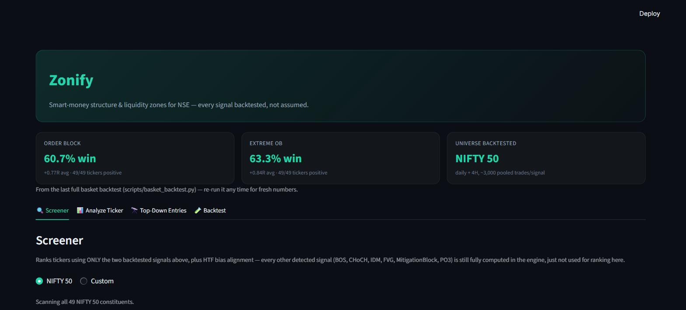

# Zonify

**Smart-money structure & liquidity zones for NSE — every signal backtested, not assumed.**

Zonify is an SMC (Smart Money Concepts / ICT) structure-and-liquidity engine for Indian (NSE) stocks, built around one rule: nothing ships as "the signal" until it's been backtested across a real universe of tickers and shown to actually work. It detects the classic vocabulary — swing structure, BOS/CHoCH, inducement sweeps, Fair Value Gaps, Order Blocks, Breaker Blocks, top-down multi-timeframe entries — then measures every one of them against real NSE price history so the screener only ranks on what's proven.



## The headline finding

Across all **49 NIFTY 50 constituents**, daily + 4H, thousands of pooled trades per signal:

| Signal | Win rate | Expectancy | Consistency |
|---|---|---|---|
| **Extreme Order Block** | 63.3% | **+0.84R** | **49/49 tickers positive** |
| **Order Block** | 60.7% | **+0.77R** | **49/49 tickers positive** |
| BOS / CHoCH / IDM (raw structure breaks) | 25–32% | -0.02R to -0.21R | inconsistent, ~15-20/49 |
| Mitigation Block | 15–19% | **-0.44R to -0.53R** | 1–4/49 |

Two specific setups — Order Block and Extreme Order Block — carry real, consistent statistical edge everywhere they were tested. Most of the other popular SMC concepts (BOS, CHoCH, plain IDM, PO3) do not, at least not as standalone signals under this backtest model. That result — not an assumption, not a vibe — is what the screener is built around. Re-run `scripts/basket_backtest.py` any time to reproduce or refresh these numbers.

## What's in here

- **Structure detection** (`src/structure_engine.py`) — fractal swing points, BOS/CHoCH, inducement (IDM), with both a raw "internal" tier and a filtered "swing" tier that only keeps genuinely significant swings.
- **Points of Interest** (`src/poi_engine.py`) — Fair Value Gaps (with premium/discount validity), Order Blocks, Extreme Order Blocks, Mitigation Blocks, and Breaker Blocks (with 2-candle confirmation to filter out fakeout reversals).
- **Multi-timeframe orchestration** (`src/multi_timeframe.py`) — runs the same engine independently across monthly → weekly → daily → 4H → 1H → 15min → 5min → 1min and rolls it into a top-down bias alignment.
- **Top-down entries** (`src/top_down.py`) — tags POIs by source timeframe and filters lower-timeframe entries to only those where a Market Structure Shift + FVG occurs inside an active higher-timeframe zone.
- **Session models** (`src/session_model.py`) — Power-of-Three (Accumulation/Manipulation/Distribution) and OHLC-vs-OLHC daily range classification.
- **Backtester** (`src/backtester.py`) — R-multiple, no-lookahead simulation deriving entry/stop/target from each signal's own structural invalidation level, not an arbitrary risk model.
- **Fundamentals** (`src/fundamentals.py`) — all-time high/low, yearly price stats, dividends, splits, and earnings history, layered on top of (never mixed into) the price/structure pipeline.
- **Screener** (`src/screener.py`) — ranks a ticker universe using *only* the two validated signals above, plus HTF bias alignment.
- **Dashboard** (`app/app.py`) — the Streamlit app in the screenshot above.

## Quickstart

```bash
pip install -r requirements.txt
streamlit run app/app.py
```

Or use the pieces directly from the command line:

```bash
python scripts/run_screener.py --with-fundamentals        # rank the NIFTY 50 today
python scripts/basket_backtest.py                          # reproduce the headline numbers
python scripts/analyze_ticker.py RELIANCE --timeframes daily 4h
python scripts/top_down_backtest.py                         # HTF-zone -> LTF entry validation
```

## Running the tests

```bash
for f in tests/test_*.py; do python "$f"; done
```

~150 hand-built tests across 9 files — every test constructs candles where the "correct" answer is known in advance (no synthetic-random data for anything geometry-sensitive), following the same convention throughout the project.

## Honest limitations

- **Data**: built on `yfinance`, which has real limits — 1-minute data only ~7 days, 5/15/30-min ~60 days, hourly ~180-730 days. Fundamentals coverage for NSE tickers is inconsistent, especially for smaller caps.
- **Sample size**: the validated signals have thousands of pooled trades across the whole NIFTY 50 — solid for the descriptive backtest stats reported here, but *not* validated for training an ML model without real risk of overfitting.
- **Backtest, not a live track record**: this measures historical signal quality with a fixed 2R/20-bar model. It is not proof of forward performance, and nothing here is investment advice.
- **What's still just "detected," not "proven"**: BOS, CHoCH, plain IDM, standalone FVG, Mitigation Block, and PO3 are all fully implemented and available in the engine — they're just not used by the screener's default ranking, because the basket backtest didn't find reliable edge in them on their own.

## Project structure

```
src/                  core engine -- data, structure, POIs, backtester, screener, fundamentals
tests/                unit tests, one file per src module
scripts/              CLI tools -- screener, basket backtest, top-down backtest, single-ticker analysis
app/                  Streamlit dashboard
data/                 synthetic test fixtures + generated chart previews
docs/                 README assets
```
